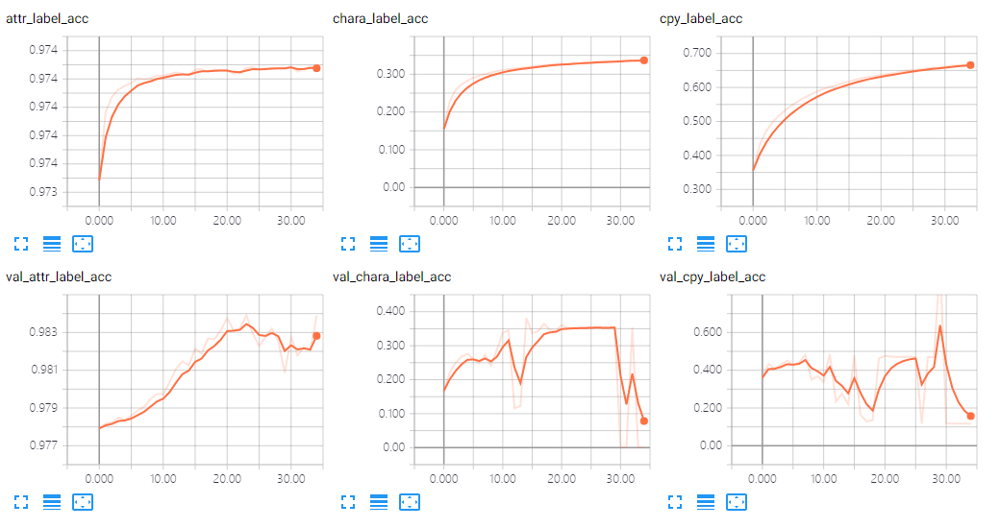
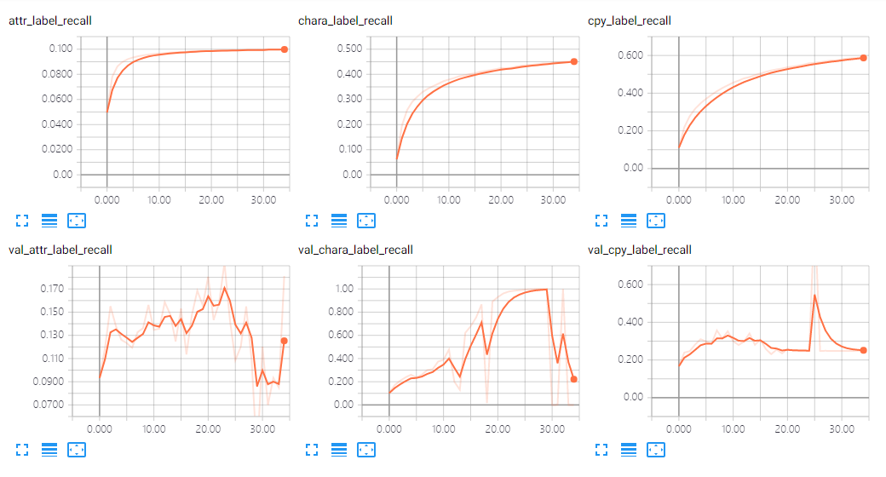
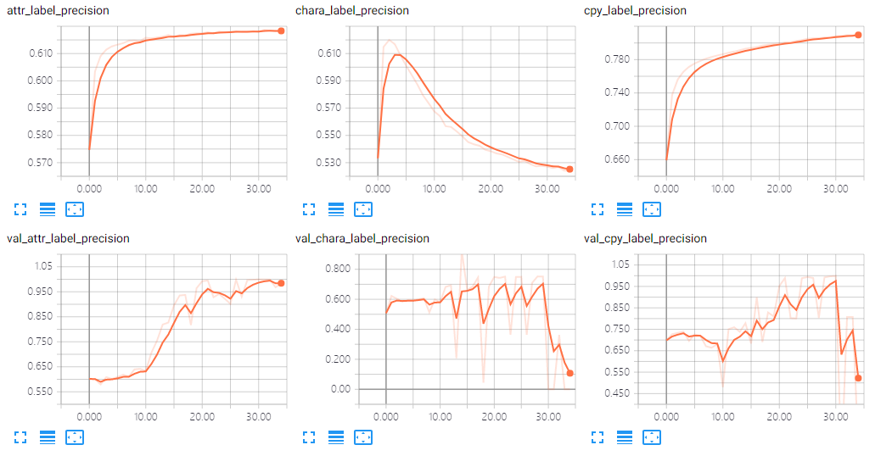
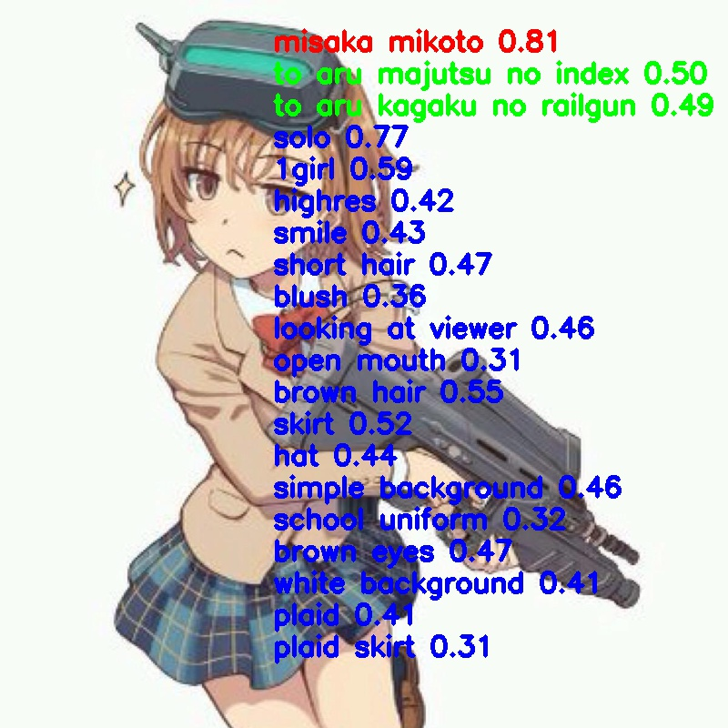
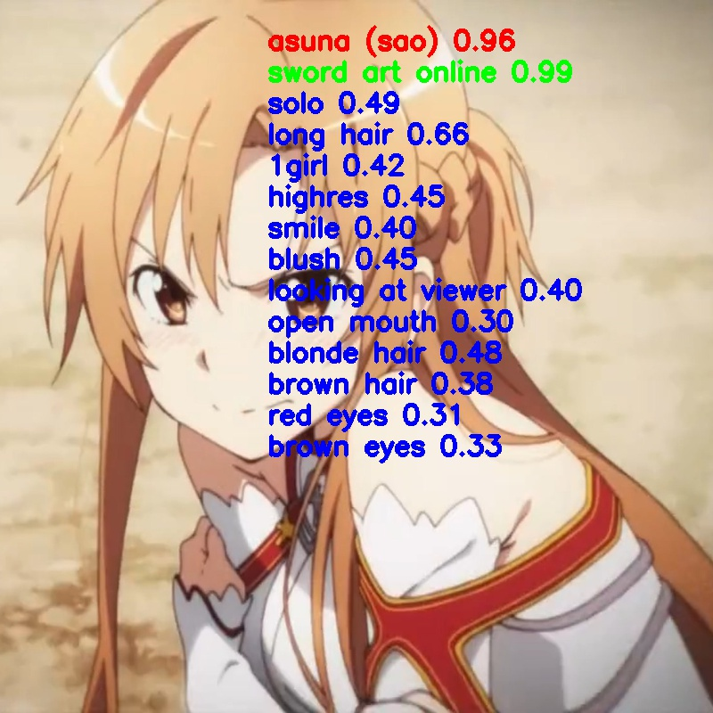
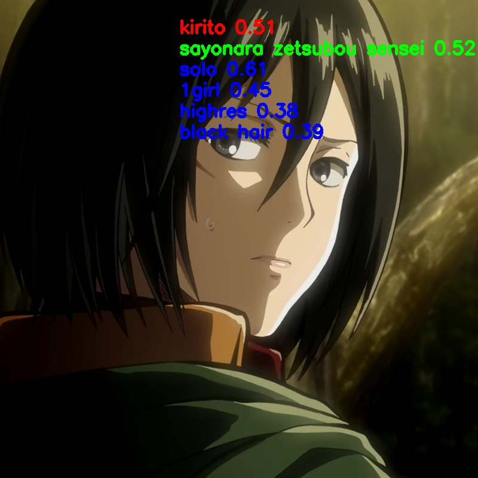
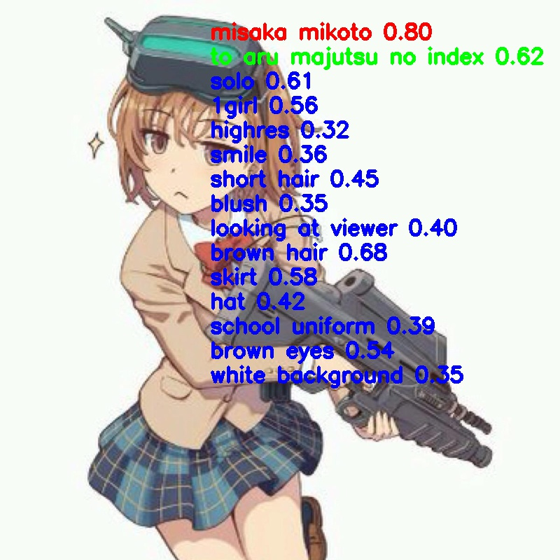
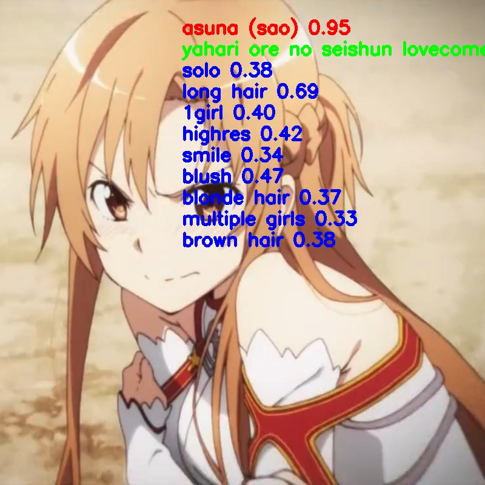
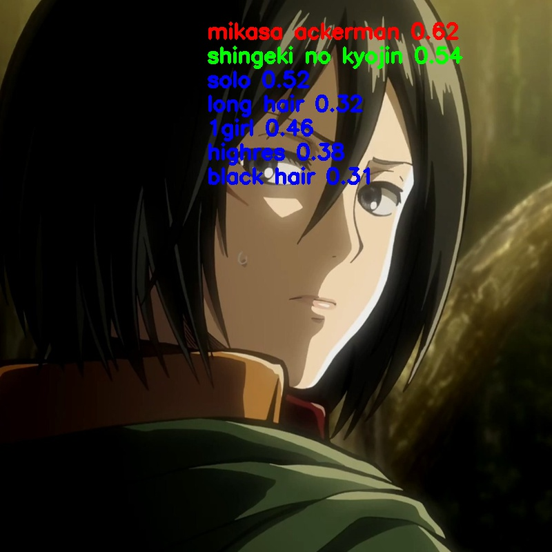
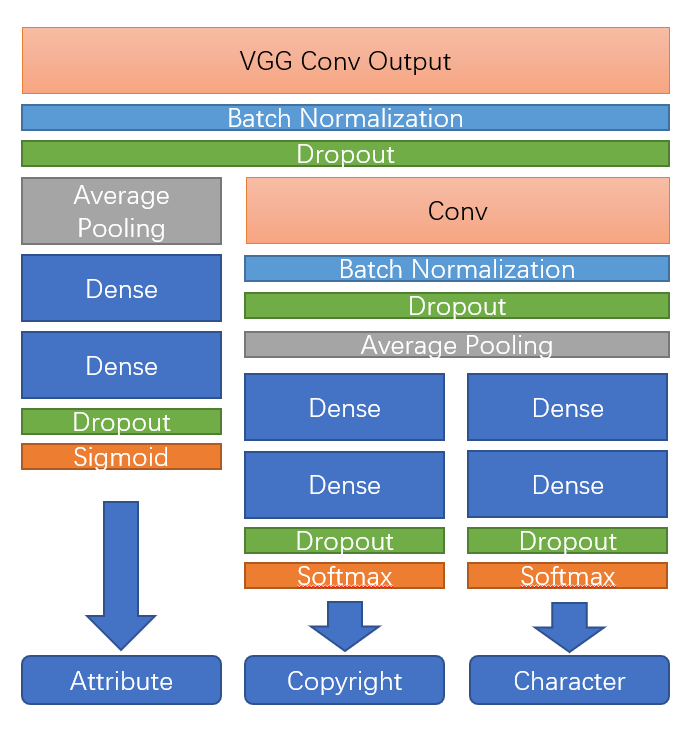

# Keras-Illustration2Vec

An modified version of Illustration2Vec. Written in Keras. As I am a starter of deep learning, any comment will be appreciated.

# Usage

Download pretrained model at

```
link：https://pan.baidu.com/s/1cDFfuP2bY417zRaL-cOrwQ 
code：hvos 
```

Modify the `pic` path in `img_test.ipynb` to your image and run!


# Loss/Acc/Precision/Recall Curves

## Acc

Note that epoch 29 has a very high `copyright` accuracy (`0.97`)



## Recall

However, epoch `29` has a low recall on `attribute`, which means it predicts more right attribute to label 0. Some epochs that have a relative high recall is `20` `23` `27` , and their accuracies are also good.



## Precision

Finally I decided to use epoch `20`, because its precision on `character` is also good comparing `23` and `27`.



# Some Test

Test code can be found in `img_test.ipynb`

## Epoch 20







## Epoch 29







# How I wrote this

## Crawler

At first I referred to https://github.com/GINK03/alt-i2v , he wrote tag information into multi text files, I tried it also, but that is a bad idea because handling multi small files is so time consuming. Just export the tags into `csv` files.

Here are my steps:

1. Run `screen -d -m python anime_crawl 0 10` at `Img_Crawler` folder to divide the crawl task(270,000,000 images) into 10 sub tasks and start the first task(0~27,000,000)
2. Repeat `screen -d -m python anime_crawl 1 10` ...`screen -d -m python anime_crawl 9 10`
3. Finally you'll get  an `images` folder containing about 250,000,000 images and 10 `tags_*.csv`
4. Read these `csv` files and combined them into one for future use
5. Find out `512` most popular tags in `character` `copyright` and `attribute`, and write them into a pickle file for future use
6. We only care about the `512*3` prediction, so clean the images which do not contain those `512*3` tags and convert the text tags into tag id(`0~511` for each), and cache a `imgid2label.pkl` file


## Training

At first I used `flow_from_dataframe` to get `(img, img_id)` and convert`img_id` to `label` so that that's a training `(x,y)` pair, but I found it's so slow even using `use_multiprocessing=True`, that's because it needs much time to load the images on the disk into ram.  And the val loss is wrong (Sometimes NaN) because `use_multiprocessing` may duplicate the data. (This method can be found at `run_vgg_v3.py`)

Then I preprocessed the images into `(256,256)` and cache them into numpy files. I have a ram of about 200GB, so I divided the whole images (about 250GB) into 4*10 numpy files(`train_x_0.npz train_y{0,1,2}_0.npy`...`train_x_9.npy train_y{0,1,2}_9.npy` and `val_x.npz val_y{0,1,2}.npy`) so that memory won't overflow and train them using `flow` and `fit_generator`.

## Structure and future improvement



```
__________________________________________________________________________________________________
Layer (type)                    Output Shape         Param #     Connected to                     
==================================================================================================
input_1 (InputLayer)            (None, 256, 256, 3)  0                                            
__________________________________________________________________________________________________
block1_conv1 (Conv2D)           (None, 256, 256, 64) 1792        input_1[0][0]                    
__________________________________________________________________________________________________
block1_conv2 (Conv2D)           (None, 256, 256, 64) 36928       block1_conv1[0][0]               
__________________________________________________________________________________________________
block1_pool (MaxPooling2D)      (None, 128, 128, 64) 0           block1_conv2[0][0]               
__________________________________________________________________________________________________
block2_conv1 (Conv2D)           (None, 128, 128, 128 73856       block1_pool[0][0]                
__________________________________________________________________________________________________
block2_conv2 (Conv2D)           (None, 128, 128, 128 147584      block2_conv1[0][0]               
__________________________________________________________________________________________________
block2_pool (MaxPooling2D)      (None, 64, 64, 128)  0           block2_conv2[0][0]               
__________________________________________________________________________________________________
block3_conv1 (Conv2D)           (None, 64, 64, 256)  295168      block2_pool[0][0]                
__________________________________________________________________________________________________
block3_conv2 (Conv2D)           (None, 64, 64, 256)  590080      block3_conv1[0][0]               
__________________________________________________________________________________________________
block3_conv3 (Conv2D)           (None, 64, 64, 256)  590080      block3_conv2[0][0]               
__________________________________________________________________________________________________
block3_pool (MaxPooling2D)      (None, 32, 32, 256)  0           block3_conv3[0][0]               
__________________________________________________________________________________________________
block4_conv1 (Conv2D)           (None, 32, 32, 512)  1180160     block3_pool[0][0]                
__________________________________________________________________________________________________
block4_conv2 (Conv2D)           (None, 32, 32, 512)  2359808     block4_conv1[0][0]               
__________________________________________________________________________________________________
block4_conv3 (Conv2D)           (None, 32, 32, 512)  2359808     block4_conv2[0][0]               
__________________________________________________________________________________________________
block4_pool (MaxPooling2D)      (None, 16, 16, 512)  0           block4_conv3[0][0]               
__________________________________________________________________________________________________
block5_conv1 (Conv2D)           (None, 16, 16, 512)  2359808     block4_pool[0][0]                
__________________________________________________________________________________________________
block5_conv2 (Conv2D)           (None, 16, 16, 512)  2359808     block5_conv1[0][0]               
__________________________________________________________________________________________________
block5_conv3 (Conv2D)           (None, 16, 16, 512)  2359808     block5_conv2[0][0]               
__________________________________________________________________________________________________
block5_pool (MaxPooling2D)      (None, 8, 8, 512)    0           block5_conv3[0][0]               
__________________________________________________________________________________________________
batch_normalization_1 (BatchNor (None, 8, 8, 512)    2048        block5_pool[0][0]                
__________________________________________________________________________________________________
low_features (Dropout)          (None, 8, 8, 512)    0           batch_normalization_1[0][0]      
__________________________________________________________________________________________________
high_features (Conv2D)          (None, 6, 6, 512)    2359808     low_features[0][0]               
__________________________________________________________________________________________________
batch_normalization_2 (BatchNor (None, 6, 6, 512)    2048        high_features[0][0]              
__________________________________________________________________________________________________
dropout_2 (Dropout)             (None, 6, 6, 512)    0           batch_normalization_2[0][0]      
__________________________________________________________________________________________________
average_pooling2d_2 (AveragePoo (None, 1, 1, 512)    0           dropout_2[0][0]                  
__________________________________________________________________________________________________
average_pooling2d_1 (AveragePoo (None, 1, 1, 512)    0           low_features[0][0]               
__________________________________________________________________________________________________
flatten_2 (Flatten)             (None, 512)          0           average_pooling2d_2[0][0]        
__________________________________________________________________________________________________
flatten_3 (Flatten)             (None, 512)          0           average_pooling2d_2[0][0]        
__________________________________________________________________________________________________
flatten_1 (Flatten)             (None, 512)          0           average_pooling2d_1[0][0]        
__________________________________________________________________________________________________
dense_3 (Dense)                 (None, 512)          262656      flatten_2[0][0]                  
__________________________________________________________________________________________________
dense_5 (Dense)                 (None, 512)          262656      flatten_3[0][0]                  
__________________________________________________________________________________________________
dense_1 (Dense)                 (None, 512)          262656      flatten_1[0][0]                  
__________________________________________________________________________________________________
dropout_3 (Dropout)             (None, 512)          0           dense_3[0][0]                    
__________________________________________________________________________________________________
dropout_4 (Dropout)             (None, 512)          0           dense_5[0][0]                    
__________________________________________________________________________________________________
dense_2 (Dense)                 (None, 512)          262656      dense_1[0][0]                    
__________________________________________________________________________________________________
dense_4 (Dense)                 (None, 512)          262656      dropout_3[0][0]                  
__________________________________________________________________________________________________
dense_6 (Dense)                 (None, 512)          262656      dropout_4[0][0]                  
__________________________________________________________________________________________________
dropout_1 (Dropout)             (None, 512)          0           dense_2[0][0]                    
__________________________________________________________________________________________________
chara_label (Lambda)            (None, 512)          0           dense_4[0][0]                    
__________________________________________________________________________________________________
cpy_label (Lambda)              (None, 512)          0           dense_6[0][0]                    
__________________________________________________________________________________________________
attr_label (Activation)         (None, 512)          0           dropout_1[0][0]                  
==================================================================================================
Total params: 18,654,528
Trainable params: 15,736,832
Non-trainable params: 2,917,696
__________________________________________________________________________________________________
```

### About softmax in Keras

Keras and Tensorflow Version will cause an error when using following code

```
  x = Dense(5000, activation="softmax")(x)
```

  We can use following code instead:

```
  x = Dense(5000)(x)
  x = (Lambda(lambda x: K.tf.nn.softmax(x)))(x)
```

### Multi-label predition

  However, `softmax` is used for **multi-class**, but not for **multi-label**, we should use `sigmoid` here. Details can be seen at <https://www.pyimagesearch.com/2018/05/07/multi-label-classification-with-keras/>

```
 the goal here is to treat each output label as an independent Bernoulli distribution
```

Loss should also be corresponding `binary_crossentropy`

### Modification and improment

`independent Bernoulli distribution` here is very important. However, both `copyright` and `character` are not independent, because if you are person A, you can not be person B. As for `attribute`, it's the same. If you are `white hair` , then you have little chance to be `black hair`. For convenience, I just used `softmax` for both `copyright` and `character`. For `attribute`, we could use `co-occurrence matrix` to analyze which tags won't come out at the same time, and modify the corresponding loss function, but I didn't implement this. And I think  `copyright` and `character` can be constructed by `attribute`, which means they have a deeper meaning, so one more `Conv` layer.

